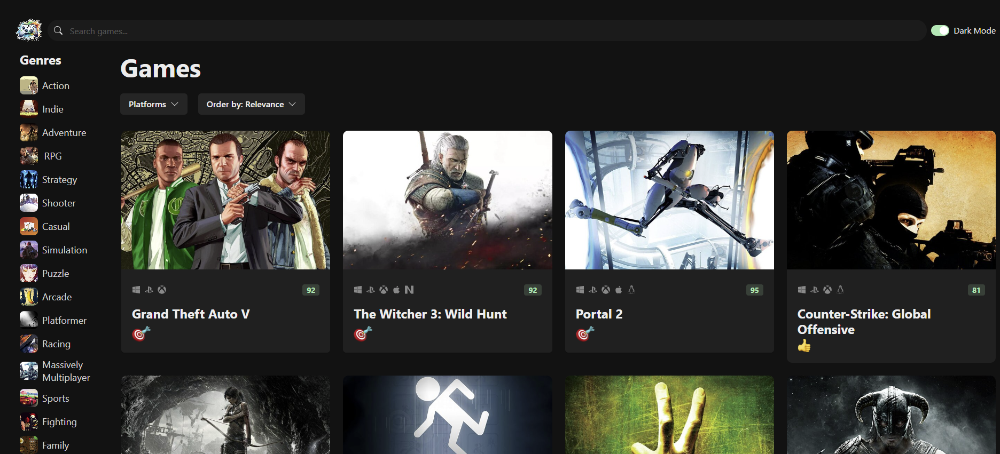
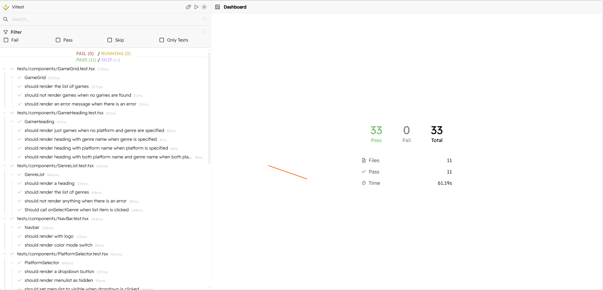

# **Game Hub**

Welcome to the **Game Hub** project! This application allows users to browse, sort and search for video games. The app is a replica of the **[RAWG.io](https://rawg.io)** website and is build using React, Typescript, [Chakra UI](https://v2.chakra-ui.com/), and the **[RAWG API](<https://api.rawg.io/docs/>)**.

## Table of Contents

- [**Game Hub**](#game-hub)
  - [Table of Contents](#table-of-contents)
  - [Features](#features)
  - [Getting Started](#getting-started)
    - [Prerequisites](#prerequisites)
    - [Installation](#installation)
  - [Usage](#usage)
  - [Testing](#testing)
  - [Screenshots](#screenshots)

## Features

- **Browse games:** Users can browse through a collection of video games.
- **Sort games:** Sort games by various parameters such as popularity, release date, etc.
- **Search games:** Search for specific video games by title.
- **Responsive Design:** The UI is built using Chakra UI, ensuring a responsive and visually appealing design across devices.

## Getting Started

### Prerequisites

Make sure you have the following installed:

- Node.js (v16 or higher)
- npm or yarn

### Installation

1. Clone the repository:

    ```bash
        git clone https://github.com/BrianKiarieMwaniki/game-hub/tree/develop
    ```

2. Navigate the project directory:

    ```bash
        cd game-hub
    ```

3. Install the dependencies:

   ```bash
    npm install
   ```

   or

   ```bash
   yarn install
   ```

## Usage

To start the development server, run:

```bash
    npm run dev
```

or

```bash
    yarn dev
```

## Testing

This project use **[Vitest](https://vitest.dev/)** for unit testing. To run the tests, use the following commands:

```bash
    npm test
    npm run test:ui
```

or

```bash
    yarn test
    yarn test:ui
```

Testing includes the following:

- Unit tests for React component using Vitest and React Testing Library(RTL).
- Mocking API calls using Mock Service Worker(MSW).

## Screenshots

- **Home Page:**
  

- **Game View:**
  

- **Test Coverage:**
   
